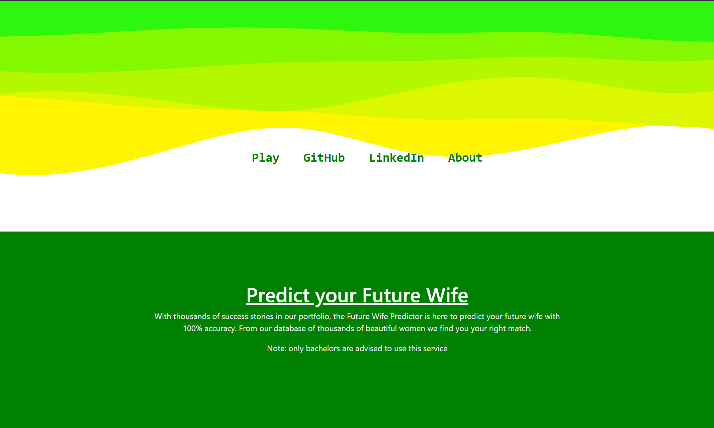

# Future Wife Predictor

The Future Wife Predictor App is a fun app that predicts a user's future wife based on a database of images of women. The app is designed to be easy to use and enjoyable for users of all ages.

<p align="center">
<a href="https://github.com/1Shubham7">
    
  </a>  
</p>

## About

This app was created as a fun way for users to predict their future partner based on a database of images of women. The goal of the project is to create a diverse and inclusive database that accurately represents the many different types of people that exist in the world.

## Technology Used
<p align="center">
   
  
  
  
</p>

We plan to add the Django REST framework as the backend in the future.

<hr>

## Preview


## Setting up locally

### Step 1
Please make sure you have NodeJS installed on your device.

<a href = "https://nodejs.org/en" align = "center"></a>

### Step 2
Clone the repository using :

```
git clone https://github.com/1Shubham7/Wife-Predictor-v2
```
### Step 3
In your local directory of the project, install the node dependencies using :

```
npm install
```

### Step 4
Run the project in your local browser using : 

```
npm start
```

--- 

## Contributors

Thanks to all our amazing contributors:


## Contributing
If you would like to contribute to this project, please read the [Contribution guidelines](CONTRIBUTING.md) and make sure to follow the [Code Of Conduct](CODE_OF_CONDUCT.md).


## Feedback and Support
If you encounter any issues with the Future Wife Predictor App or have any feedback or suggestions, please open an issue in the Issues section of this repository. We appreciate your feedback and will respond as soon as possible.

## License
[](https://github.com/1Shubham7/Wife-Predictor-v2/blob/main/LICENSE)


